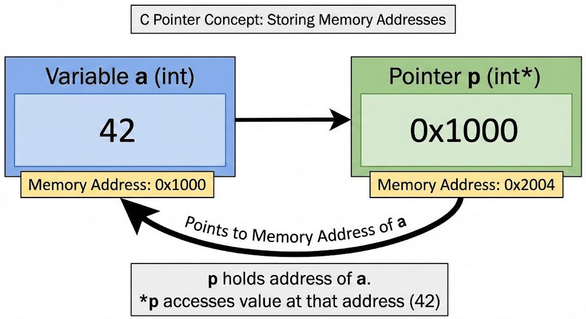

# Pointers in C Programming

This section introduces **pointers**, one of the most powerful and challenging concepts in C programming.
Pointers allow you to directly work with memory addresses, giving you fine-grained control
over how your program uses memory.

Pointers are often considered difficult, but with practice and clear examples, you can master them!

---

## What is a pointer?

A pointer is a variable that stores the **memory address** of another variable.

Instead of holding a value like `5` or `'A'`, a pointer holds the **location in memory**
where that value is stored.

Think of it like this:
- A regular variable is like a **box** containing a value
- A pointer is like a **note** that tells you which box to look in

---

## Why are pointers important?

Pointers are fundamental to C and essential for:
- **Dynamic memory allocation** - creating variables at runtime
- **Efficient function calls** - passing large data without copying
- **Data structures** - building linked lists, trees, and graphs
- **Array manipulation** - working with arrays efficiently
- **String handling** - C strings are actually character pointers
- **System programming** - direct hardware and memory access

Many advanced C features simply cannot exist without pointers!

---

## Core Concepts in This Section

In this folder, you will learn about:
- memory addresses and the `&` operator
- pointer declaration and the `*` operator
- dereferencing pointers (accessing the value at an address)
- pointer initialization and NULL pointers
- pointers and functions
- common pointer mistakes and how to avoid them

---

## 🔑 Key Operators

### **The Address-Of Operator: `&`**

`&variable` returns the **memory address** of a variable.

```c
int x = 10;
printf("%p", &x);  // Prints memory address, like: 0x7ffeeb2c895c
```

### **The Dereference Operator: `*`**

`*pointer` accesses the **value stored at** the memory address.

```c
int *ptr = &x;     // ptr stores the address of x
printf("%d", *ptr); // Prints the value at that address: 10
```

**Note:** The `*` symbol has two different meanings:
1. In **declaration**: `int *ptr` means "ptr is a pointer to an int"
2. In **usage**: `*ptr` means "the value at the address stored in ptr"

---

## Basic Pointer Example

A simple example demonstrating pointer basics:

```c
#include <stdio.h>

int main(void) {
    int num = 42;        // Regular variable
    int *ptr;            // Pointer declaration
    
    ptr = &num;          // Store address of num in ptr
    
    printf("Value of num: %d\n", num);           // 42
    printf("Address of num: %p\n", &num);        // Memory address
    printf("Value of ptr: %p\n", ptr);           // Same memory address
    printf("Value at ptr: %d\n", *ptr);          // 42 (dereferencing)
    
    // Modify the value through the pointer
    *ptr = 100;
    
    printf("New value of num: %d\n", num);       // 100
    
    return 0;
}
```

---

## Explanation

`int *ptr` declares a pointer to an integer

`ptr = &num` stores the memory address of `num` in `ptr`

`*ptr` accesses the value stored at the address in `ptr` (dereferencing)

`*ptr = 100` changes the value at that address

Changing `*ptr` also changes `num` because they point to the same location!

---

## Visual Understanding

Let's visualize what happens in memory:

```
Memory Layout:
┌──────────────┬─────────┬──────────────┐
│   Address    │  Name   │    Value     │
├──────────────┼─────────┼──────────────┤
│  0x1000      │   num   │     42       │  ← Regular variable
│  0x2000      │   ptr   │   0x1000     │  ← Pointer (stores address)
└──────────────┴─────────┴──────────────┘

When you write: ptr = &num
  → ptr now stores 0x1000 (the address of num)

When you write: *ptr
  → Go to address 0x1000 and get the value there (42)

When you write: *ptr = 100
  → Go to address 0x1000 and change the value to 100
  → num is now 100!
```

---

## Common Beginner Mistakes

*You're not Cheddar, you're just some common bitch.* 🐕 (when your pointer points to the wrong address!)

- **Forgetting to initialize pointers** - using a pointer before assigning an address

- **Confusing `*` in declaration vs usage** - `int *ptr` vs `*ptr`

- **Dereferencing NULL pointers** - causes crashes!

- **Mixing up `&` and `*`** - `&` gets address, `*` gets value

- **Pointer arithmetic confusion** - will be covered later

- **Not understanding pointer-to-pointer** - advanced topic for later

---

## NULL Pointers

A pointer that doesn't point to anything should be set to `NULL`:

```c
int *ptr = NULL;  // Safe: pointer explicitly points to nothing

if (ptr != NULL) {
    printf("%d", *ptr);  // Only dereference if not NULL
}
```

**Always check for NULL before dereferencing!**

Dereferencing a NULL pointer causes a **segmentation fault** (crash).

---

## Practice Suggestions

Declare pointers and print their values and addresses

Create a function that swaps two numbers using pointers

Use pointers to modify variables from different scopes

Draw memory diagrams on paper for your programs

Experiment with dereferencing and see what happens

---

## Examples

- [ex-1.c](ex-1.c)
- [ex-2.c](ex-2.c)
- [ex-3.c](ex-3.c)
- [ex-4.c](ex-4.c)
- [ex-5.c](ex-5.c)

- [Swap-Function.c](Swap-Function.c)

---

## FAQs: Why do we need pointers? Can't we just use regular variables?

**Short answer**: For simple programs, yes. For real-world C programming, no.

**Long answer**: Pointers enable features that regular variables can't:

1. **Modifying function arguments**: C passes arguments by value (copies them).
   Without pointers, a function can't modify the original variable.

   ```c
   void increment(int *num) {
       (*num)++;  // Modifies the original
   }
   ```

2. **Dynamic memory**: You can't create arrays of unknown size without pointers.

   ```c
   int *arr = malloc(n * sizeof(int));  // Create array at runtime
   ```

3. **Efficiency**: Passing a large struct by pointer is much faster than copying it.

4. **Data structures**: Linked lists, trees, graphs all require pointers.

5. **Strings**: In C, strings are just pointers to character arrays.

**The reality**: Avoiding pointers means avoiding most of what makes C powerful!

---

## FAQs: What does "dereferencing" mean?

**Dereferencing** means "following the pointer to get the value it points to."

Think of it like following directions:
- The pointer is the **address** ("123 Main Street")
- Dereferencing is **going to that address** and seeing what's there

```c
int x = 50;
int *ptr = &x;

// ptr holds an address (like "123 Main Street")
// *ptr follows that address and gets the value (50)

printf("%p", ptr);   // Prints address
printf("%d", *ptr);  // Prints value at that address (50)
```

The `*` operator is how you tell C: "Don't show me the address, show me what's **at** that address!"

---

## FAQs: Why does my program crash with "Segmentation Fault"?

**Segmentation faults** usually mean you tried to access memory you shouldn't.

Common causes:

1. **Dereferencing NULL**:
   ```c
   int *ptr = NULL;
   printf("%d", *ptr);  // CRASH!
   ```

2. **Uninitialized pointer**:
   ```c
   int *ptr;            // Points to random memory!
   *ptr = 10;           // CRASH!
   ```

3. **Dangling pointer** (advanced):
   ```c
   int *ptr = malloc(sizeof(int));
   free(ptr);
   *ptr = 10;           // CRASH! Memory was freed
   ```

**Solution**: Always initialize pointers, check for NULL, and be careful with memory!

---

## Tips for Learning Pointers

1. **Draw diagrams** - Visualize memory boxes and arrows
2. **Use printf** - Print addresses and values to understand what's happening
3. **Start small** - Master basic pointers before pointer arithmetic
4. **Practice debugging** - Use `gdb` or add print statements
5. **Be patient** - Pointers click suddenly after enough practice
6. **Compile with warnings** - `gcc -Wall` catches many pointer errors

**Remember**: Everyone struggles with pointers at first. It's normal! Keep practicing and it WILL make sense. 

---

## What's Next?

Once you understand basic pointers, you'll move on to:
- Pointer arithmetic
- Pointers and arrays
- Pointers to pointers
- Function pointers (advanced)
- Dynamic memory allocation

But first, **master the basics**! Everything else builds on this foundation.

---

## Important

Please ensure that you clearly understand the difference between the `&` and `*` operators. The `&` operator is used to get the address of a variable, while the `*` operator is used to dereference a pointer (i.e., to get the value stored at the address that the pointer points to). For the understand easily, you can examine the following image which created with Google Gemini AI from me.

